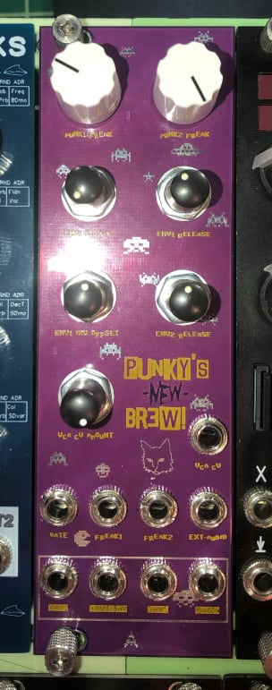

## Punky's New Brew - Eurorack Drum Module

{width=50% height=50%}

**Description:**
Punky's New Brew is an exciting Eurorack drum module created by Juan Segovia. This DIY module produces percussive arcade-style sounds and is perfect for electronic music enthusiasts and synthesizer aficionados. This repository contains the KiCad project files, Gerber files, and other resources related to the construction of the module.

**YouTube Channel:** [Juan's YouTube Channel](https://www.youtube.com/channel/UC0b9VIyAkoUc2IhSYS2gNUg)

**Blog:** [Juan's Blog - Scruffy Cat Studios](scruffycatstudios.com)

For step-by-step instructions on how to build Punky's New Brew and to gain valuable insights into DIY electronics and Eurorack modules, be sure to check out Juan's YouTube channel and blog. Dive into the world of modular synthesis and start creating your own unique soundscapes with this versatile Eurorack module.
